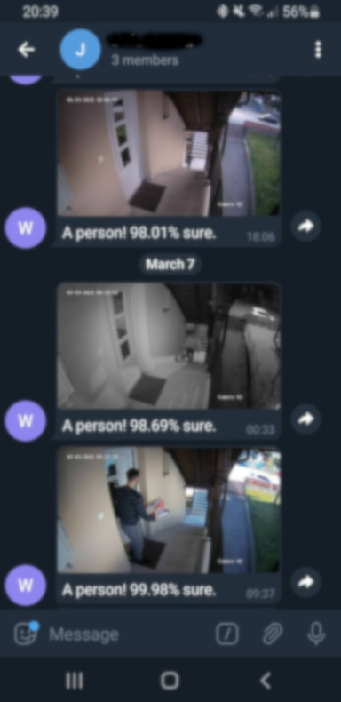

## About The Project
whosthat is app for detecting people on CCTV/cameras and sending notifications with photo snapshots using Telegram bot.

## whosthat in action
This is what it looks like on my phone in action. Never misses a single person, not even in infrared mode (during night time) :)

### Built With
* Java 14
* Spring Boot 2.4.2
* OpenCV 4.2.0-0
* darknet/yolo

### Tested with
* Docker 20.10.5
* Gradle 6.7.1
* HikVision VR DS-7604NI-K1 / 4P

## Getting Started

### Prerequisites

To be able to run whosthat, working Docker installation and gradle should be available on your machine:
* check if Docker is working
  ```sh
  docker -v
  ```
    If version not printed, make sure to install Docker first.
* check if gradle is working
  ```sh
  gradle -v
  ```
  If version not printed, make sure to install gradle first.
### Installation

1. Clone the repo
   ```sh
   git clone https://github.com/karlonovak/whosthat
   cd whosthat
   ```
2. Build app and Docker image (might take a while to download darknet model)
   ```sh
   gradle docker
   ```
3. Check if Docker image created
   ```sh
   docker images | grep whosthat
   ```
    whosthat image should be printed out.
4. Fill in whosthat.env file with your data (see instructions below!)
5.  ```sh
    docker run --env-file whosthat.env whosthat
    ```
6. If everything went well, success message should be shown:
    ```sh
    Started WhosThatApplication in x.xx seconds (JVM running for y.yyy)
    ```

## Environment file

whosthat comes with provided example env file, whosthat.env file inside project root.
Environment file should be filled in with your camera's data. Available variables are:
1. [Optional] configurable log level for app, best left default
```sh
LOG_LEVEL=DEBUG
```
2. [Mandatory] this param points to an HTTP address of a JPEG image of your camera.
One such example (for my type of Hikvision camera) is shown below.
```sh
CAM_ADDRESS=http://192.168.1.50:6500/ISAPI/Streaming/channels/101/picture
```
3. [Optional] BASIC/DIGEST auth username if needed
```sh
CAM_USER=admin
```
4. [Optional] BASIC/DIGEST auth password if needed
```sh
CAM_PASS=admin1234
```
5. [Optional] frequency at which snapshot is taken from the camera 
```sh
CAM_FREQUENCY_IN_S=5
```
6. [Optional] list of rectangles to exclude from detection if camera snapshots contains parts that 
   don't need to be included for detection, example with two rectangles (delimited by '_'): 1980x0,2688x480_2400x0,2688x1520
```sh
CAM_CROP_RECTANGLES=
```
7. [Optional] Path to darknet weights, default is the one suited for Docker container (automatically downloaded on image building)
```sh
YOLO_WEIGHTS=/opt/darknet/yolov3.weights
```
8. [Optional] Path to darknet config, default is the one suited for Docker container (automatically downloaded on image building)
```sh
YOLO_CONFIG=/opt/darknet/cfg/yolov3.cfg
```
9. [Mandatory] Telegram token (https://core.telegram.org/bots#6-botfather)
```sh
TELEGRAM_TOKEN=1785646214:ABHEd4GeiRNFRd_0dsvMKIgGmMVsDIBbosP
```
10. [Mandatory] Chat ID of a group that bot should use to send detected images to 
    (https://stackoverflow.com/questions/32423837/telegram-bot-how-to-get-a-group-chat-id)
```sh
TELEGRAM_CHAT_ID=-527125351
```
11. [Optional] To avoid spam, declare a threshold for Telegram notifications
```sh
TELEGRAM_NOTIFICATION_THRESHOLD_IN_S=60
```


